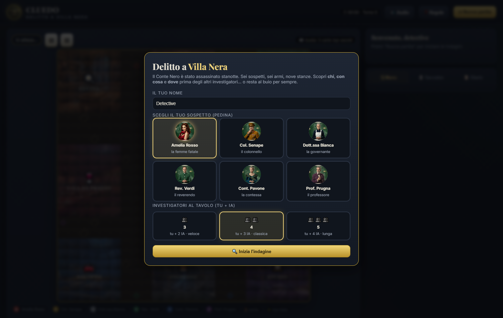
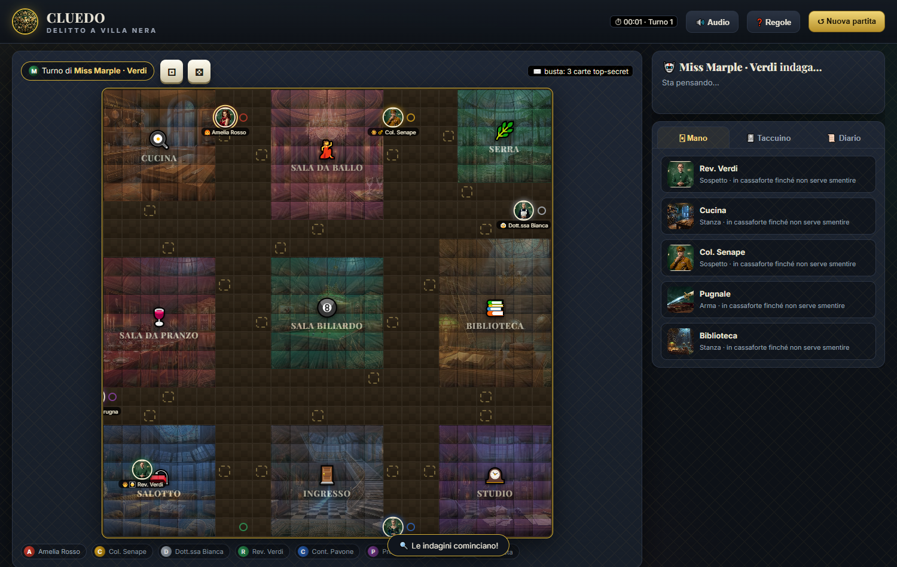
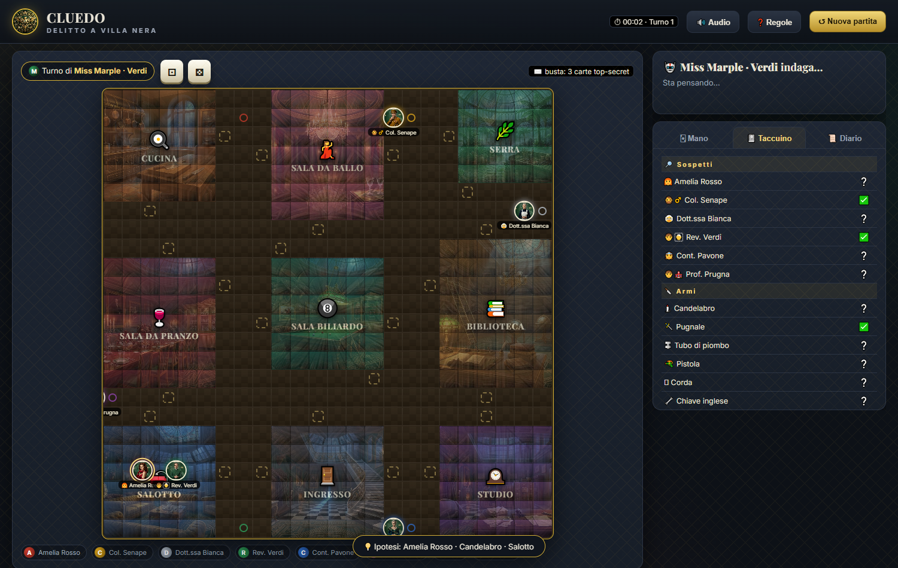

# 🕵️ CLUEDO — Delitto a Villa Nera

Un clone giocabile di **Cluedo in un unico file HTML**. Nessun server, nessuna build, nessuna dipendenza: apri il file nel browser e indaga.

> Il Conte Nero è stato assassinato stanotte a Villa Nera. Sei sospetti, sei armi, nove stanze. Scopri **chi**, **con cosa** e **dove** prima degli altri investigatori.

---

## 📸 Screenshot


*Schermata iniziale: scegli nome, pedina e numero di investigatori*


*Tabellone 24×24 con le 9 stanze, pedine e mano carte*


*Taccuino automatico per escludere sospetti, armi e stanze*

## 📖 Manuale illustrato

Leggi la lore completa — dossier dei 6 sospetti (movente, alibi, segreto), 6 armi, 9 stanze, timeline del delitto e tattiche — in **[manuale.html](manuale.html)**, con lo stesso stile noir-oro animato del gioco e gli asset veri.


*Il manuale: storia, sospetti cliccabili, armi, mappa stanze e regole*

---

## ✨ Funzionalità

- 🎲 **Dadi animati + movimento tattico** su tabellone 24×24 (caselle dorate = mete raggiungibili)
- 🚪 **9 stanze** con porte oro tratteggiate: Cucina, Sala da Ballo, Serra, Sala da Pranzo, Sala Biliardo, Biblioteca, Salotto, Ingresso, Studio
- 🚇 **Passaggi segreti:** Cucina ⇄ Studio · Serra ⇄ Salotto
- 💡 **Ipotesi** (sospetto + arma nella stanza in cui sei — il sospettato viene trascinato lì) + **smentite** in ordine di turno
- ⚖️ **Accusa finale:** vinci se indovini, eliminato se sbagli (modalità spettatore rapida)
- 🤖 **IA che deducono davvero:** si muovono verso stanze non escluse, ricordano le carte viste, accusano quando sono sicure
- 📓 **Taccuino automatico:** ✅ esclusa · 📌 sospetta · ❔ ignota (le tue carte e quelle viste si segnano da sole)
- 📜 Diario di gioco, 🔊 effetti audio WebAudio (senza file), ⏱ timer + contatore turni
- 🎨 **Asset AI opzionali** in `assets/` con fallback emoji/CSS automatico (nessun errore se mancano)

## 📁 Struttura progetto

```
/
├── cluedo.html          # ← tutto il gioco (HTML + CSS + JS)
├── assets/              # ritratti, armi, stanze, logo, texture (opzionali ma consigliati)
│   ├── suspect-rosso.jpg / -senape / -bianca / -verdi / -pavone / -prugna.jpg
│   ├── weapon-candelabro / -pugnale / -tubo / -pistola / -corda / -chiave.jpg
│   ├── room-cucina / -ballo / -serra / -pranzo / -biliardo / -biblioteca / -salotto / -ingresso / -studio.jpg
│   ├── logo.jpg / card-back.jpg / board-texture.jpg
└── README.md
```

## 🕹️ Come si gioca

1. Inserisci il nome, scegli la pedina e il numero di giocatori (tu + 2/3/4 IA)
2. **Tira i dadi** → clicca una casella dorata per muoverti, entra dalle porte oro
3. In una stanza → **💡 Ipotesi**: gli altri devono mostrarti una carta per smentirti
4. Usa il **📓 Taccuino** per escludere carte e dedurre la busta
5. Quando sei certo → **⚖️ Accusa finale**. Se l'IA accusa prima e correttamente, perdi!

**Scorciatoie tattiche:**
- Resta in stanza per ipotizzare di nuovo
- Usa i passaggi segreti per attraversare la villa senza dadi
- Dopo il turno 28 le IA osano di più: sbrigati!

## 🛠️ Tecnologie

- HTML5 + CSS3 (Playfair Display + Inter, layout responsive, zero scroll su desktop)
- Vanilla JavaScript (BFS per il movimento, state machine dei turni, IA deduttiva)
- WebAudio API per SFX sintetizzati
- Nessuna dipendenza esterna (solo Google Fonts)

## 📜 Licenza

Un omaggio investigativo — fatto con ♥ in un unico HTML. Sentiti libero di forkare, modificare e condividere.

---
*6 sospetti · 6 armi · 9 stanze · un solo colpevole*
